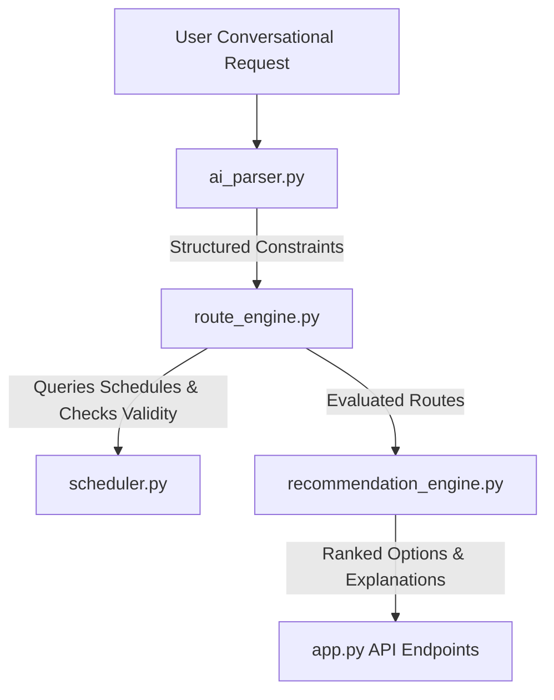

# TransitAI — Kerala Multi-Modal Transport Planner

TransitAI is a schedule-aware multi-modal route planning engine and REST API designed specifically for the state of Kerala, India. It helps travelers find the fastest, cheapest, and most comfortable routes combining the **Kochi Metro**, **Kerala Railway Network**, and **KSRTC Bus Services**.

---

## Features

- **Timetable-Aware Routing**: Calculates optimal travel options (Fastest, Cheapest, and Fewest Transfers) based on active schedules and realistic transfer windows.
- **Natural Language Parsing**: An integrated AI Query Parser that extracts trip parameters, budget caps, deadlines, and transit mode exclusions from conversational user inputs.
- **Smart Recommendations**: A recommendation module that evaluates trade-offs (e.g., cost savings vs. duration increases) to classify route options.
- **Deduplicated Location Master**: Maintains a clean, validated database of Kerala transport hubs (Kochi, Thrissur, Ernakulam, Kozhikode, Kannur, Kottayam, Kollam, Thiruvananthapuram, Palakkad, Angamaly, Tripunithura, Guruvayur, and more).

---

## Technical Architecture



### Components
1. **`scheduler.py`**: Validates waiting times, prepares transfer buffers, and matches schedule timetables.
2. **`ai_parser.py`**: Extracts source, destination, times, budget limits, deadlines, and preferences from queries.
3. **`route_engine.py`**: Model network as a NetworkX `MultiDiGraph` to run timetable-aware routing.
4. **`recommendation_engine.py`**: Generates user-facing recommendations (Best Overall, Budget Friendly, Most Comfortable) with tradeoffs.

---

## Database Schema & Ingestion

TransitAI is backed by SQLite (`database/transit.db`) containing:
- **`locations`**: Unique station, stand, or hub identifiers with coordinates, cities, and types.
- **`providers`**: Active transit systems (`KMRL` for Kochi Metro, `Indian Railways`, `KSRTC` for buses).
- **`routes`**: Direct edges between nodes representing transport legs.
- **`schedules`**: Time-specific service runs with departure/arrival timetables.

### Clean & Seed
To rebuild the database and purge any legacy non-Kerala mock records:
```cmd
venv\Scripts\python rebuild_database.py
```
This utility:
1. Resets `database/transit.db`.
2. Seeds locations from `ingestion/data/locations.json` (Kerala cities only).
3. Generates walking transfers between nearby stations in the same city.
4. Runs data importers (`metro_importer.py`, `railway_importer.py`, `bus_importer.py`).
5. Executes integrity checks (`ingestion/validation.py`).

### Exporting Masters
To generate fresh master data lists (`master_locations.json`, `master_locations.csv`, and `location_report.md`):
```cmd
venv\Scripts\python export_locations.py
```

---

## Running the Application

### Start Development Server
```cmd
venv\Scripts\python app.py
```
By default, the server runs on `http://127.0.0.1:5000/`.

---

## Testing

Run the unit test suite to verify the routing engine and parser:
```cmd
venv\Scripts\python -m unittest test_transit.py
```
